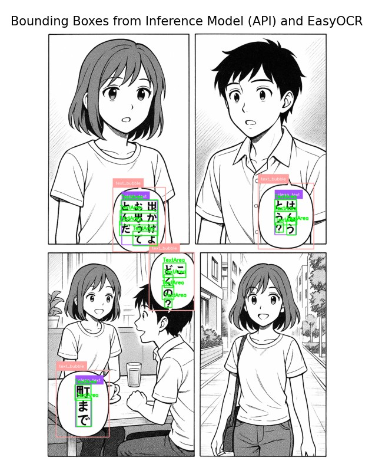
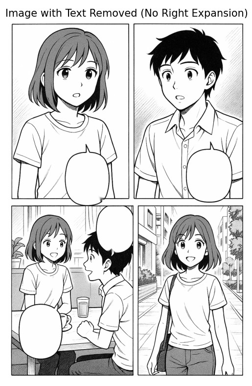
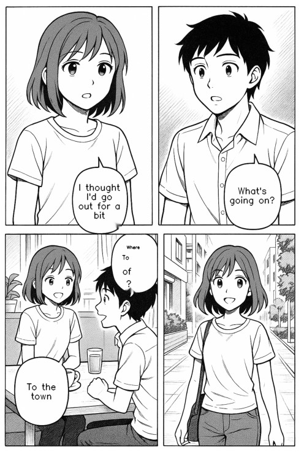

# manga-translator-prototype
Script for automatic manga translation

## What is Manga?
Manga are Japanese comic books or graphic novels, known for their unique art style and storytelling. They are popular worldwide and often published in Japanese, making them inaccessible to non-Japanese speakers.

## Why This Project?
This project aims to make manga more accessible by automating the translation process. Manual translation is time-consuming and requires both language skills and image editing. By automating text detection, extraction, translation, and reinsertion, this tool helps fans, translators, and researchers enjoy manga in their preferred language.

## Who is This For?
- Manga fans who want to read untranslated works
- Translators looking to speed up their workflow
- Researchers interested in OCR, translation, or image processing

## Prerequisites & Limitations
- Requires Python 3.8+
- Some steps may require a GPU for best performance
- Internet access is needed for API-based translation and model inference
- The pipeline is a prototype and may not work perfectly for all manga styles or image qualities

## Overview
This project is a prototype pipeline for automatic manga translation. It detects text areas in manga images, extracts the text using OCR, translates it to English, and reinserts the translated text into the image.


## Examples

Below is a demonstration of the pipeline's effect on an example AI-generated manga image:


Here is what happens when you run this pipeline on a manga scan:

1. **Original image:**

  

  _To continue pipeline execution, close the window with the image._

2. **Image with detected box areas:**

  

  _To continue pipeline execution, close the window with the image._

3. **Image with text removed:**

  

  _To continue pipeline execution, close the window with the image._

4. **Resulting image with translated text reinserted:**

  

  _To continue pipeline execution, close the window with the image._


## Requirements
- Python 3.8+
- See `requirements.txt` for dependencies

## Setup

### Script Setup (Recommended)
1. Run the setup script for your OS:
  - On Windows: Double-click `setup.bat` or run `python setup.py` in PowerShell.
  - On Mac/Linux: Run `bash setup.sh` or `python3 setup.py` in your terminal.
2. The script will:
  - Create a virtual environment
  - Install dependencies from `requirements.txt`
  - Copy `config.template.json` to `config.json` if not present
  - Create `inputs/` and `outputs/` folders if missing
3. Edit `config.json` to add your API keys and adjust parameters as needed (see below for details). You can also use the reconfigure script to update your configuration interactively at any time:
  - On Windows: Double-click `reconfigure.bat` or run `python reconfigure.py` in PowerShell.
  - On Mac/Linux: Run `bash reconfigure.sh` or `python3 reconfigure.py` in your terminal.
4. To start the translation process:
  - On Windows: Double-click `run.bat` or run `run.py` from an activated virtual environment.
  - On Mac/Linux: Run `bash run.sh` or `python3 run.py` from an activated virtual environment.
5. Translated images will be saved in the `outputs/` folder.

### Manual Setup
1. Place manga images in the `inputs/` folder (e.g., `inputs/p (1).jpg`).
2. Copy `config.template.json` to `config.json` in the project root. This will be your personal configuration file.
3. Edit `config.json` to add your API keys and adjust parameters as needed (see below for details).
4. Activate the virtual environment and run `run.py` manually:
  - On Windows: `venv\Scripts\activate.bat` then `python run.py`
  - On Mac/Linux: `source venv/bin/activate` then `python3 run.py`
5. Translated images will be saved in the `outputs/` folder.

## Configuration

1. **Copy and rename:**
   - Duplicate `config.template.json` and rename it to `config.json` in the project root.

2. **Edit your API keys:**
   - Open `config.json` and fill in your API keys:
     - `INFERENCE_API_KEY`: Required for model inference. [Get your key here](https://roboflow.com/) (Roboflow API).
     - `TOGETHER_API_KEY`: Required for translation. [Get your key here](https://www.together.ai/docs/inference/getting-started) (Together API).

3. **Adjust import parameters if needed:**
   - `input_folder`: Folder with input images (default: `inputs`)
   - `output_folder`: Folder for translated images (default: `outputs`)
   - `input_file_name`: Name of the input file (e.g., `p (1)`)

Example `config.json` structure:
```json
{
  "API_KEYS": {
    "INFERENCE_API_KEY": "your_inference_api_key",
    "TOGETHER_API_KEY": "your_together_api_key"
  },
  "IMPORT_PARAMS": {
    "input_folder": "inputs",
    "output_folder": "outputs",
    "input_file_name": "p (1)"
  }
}
```

**Important:**
- Never commit your `config.json` to version control, as it contains sensitive information.

## Folder Structure
- `inputs/` — Place your input manga images here
- `outputs/` — Translated images will be saved here
- `run.py` — Main script to run the translation pipeline
- `requirements.txt` — Python dependencies
## Reconfiguring Your Setup

If you need to update your API keys, input/output folders, or input file name after initial setup, use the reconfigure script. This is useful if you:
- Change API keys
- Want to use a different input or output folder
- Need to process a different input file

To use the reconfigure script:
- On Windows: Double-click `reconfigure.bat` or run `python reconfigure.py` in PowerShell.
- On Mac/Linux: Run `bash reconfigure.sh` or `python3 reconfigure.py` in your terminal.

The script will interactively prompt you for new values and update your `config.json` file automatically.

## Notes
- The pipeline is a prototype and may require GPU and internet access for model inference and translation.
- For best results, use high-quality manga scans.

## License
This project is for research and educational purposes only.

## Project Status
This repository is an early prototype of the Manga Translator project.
The full version is now in active development here:
 [Manga Translator – Full Version](https://github.com/Maksim23123/manga-translator)